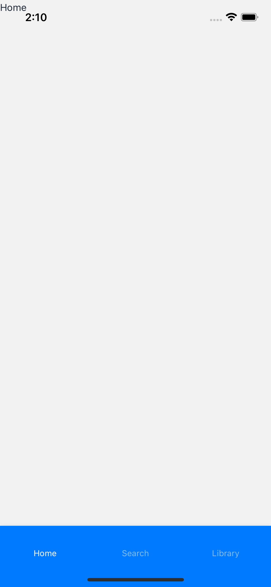
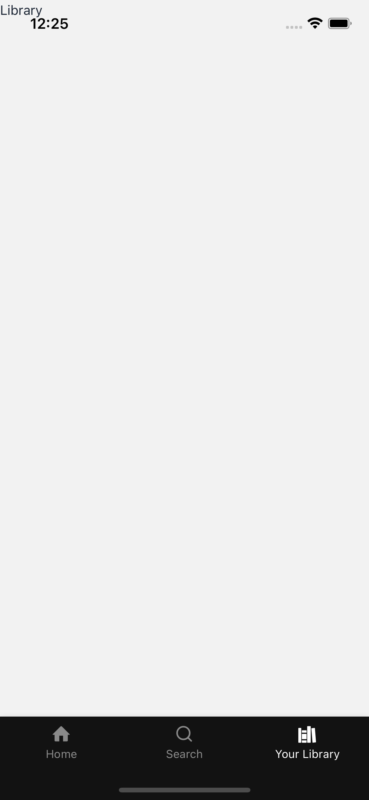
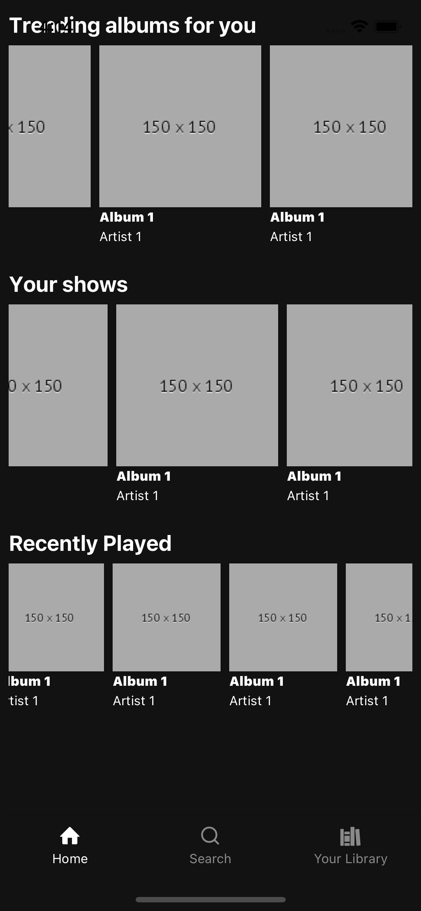
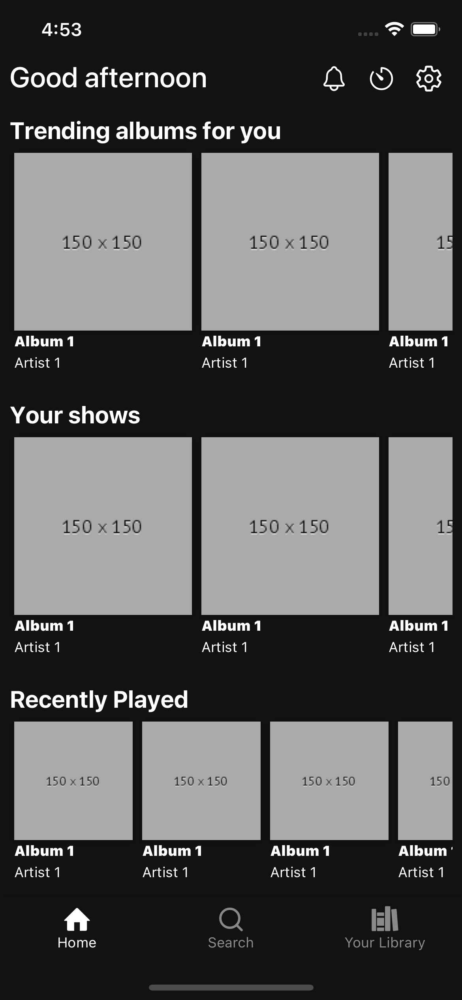

## Notes before we start
 Make sure you have these same files with the same content
 * eslintrc.js
 * prettierrc.js
 * tsconfig.json
 * metro.config.js
 * babel.config.js

 Install the dependencies:
  * ```yarn add react-native-typescript-transformer```
  * ```yarn add babel-plugin-module-resolver```
  * ```yarn add metro-react-native-babel-preset```

## Getting Started
So, let's code a Spotify clone with react-native

The first step you have to config your environment to support react-native. React-native
has a very good documentation. For this project, we will use the react-native-cli.

* Set up the environment with react-native: https://reactnative.dev/docs/environment-setup

Once you have installed everything, you can start the project. Run this command on your terminal:

```
npx react-native init SpotifyClone --template react-native-template-typescript  
```

<==============================>


For this clone we will use the [nativebase.io](https://docs.nativebase.io/) as the framework for the UI

```
// Install the nativebase.io for existing project
yarn add native-base react-native-svg react-native-safe-area-context
```

```
// Run Pod install
cd ios/
pod install
```


<==============================>

# Folder structure:

```
root/
  src/
    providers/
      Theme/index.tsx
    routes/
      index.tsx
    components/
      Button/
        index.tsx
    screens/
      Home/
        index.tsx
        styles.ts
```

Lets start creating the ThemeProvider.


```src/providers/Theme/index.tsx```

```javascript
  import React from "react";
  import { NativeBaseProvider } from "native-base";

  export function ThemeProvider({ children }: { children: React.ReactNode }) {
    return <NativeBaseProvider>{children}</NativeBaseProvider>;
  }
```

Now as we have the basic configuration for the theme, we can start creating the screens. Let's start with the Home, Search and Library screens.

```src/screens/Home/index.tsx```
```javascript
import React from "react";
import { Text } from "native-base";

export function Home() {
  return <Text>Home</Text>;
}
```


```src/screens/Search/index.tsx```
```javascript
import React from "react";
import { Text } from "native-base";

export function Search() {
  return <Text>Search</Text>;
}
```
```src/screens/Library/index.tsx```
```javascript
import React from "react";
import { Text } from "native-base";

export function Library() {
  return <Text>Library</Text>;
}
```

These are the main screens of the app. The next step is to create the bottom navigation for them. For that task, we need to install the base [reactnavigation](https://reactnavigation.org/docs/getting-started]) and [the Material Bottom Tabs](https://reactnavigation.org/docs/material-bottom-tab-navigator/). After that, we can create the bottom navigation. Remember to run pod install on the ios folder or ```npx pod-install ios```.


```src/routes/MainScreens/index.tsx```

```javascript
import React from "react";
import { createMaterialBottomTabNavigator } from "@react-navigation/material-bottom-tabs";

import { Home } from "screens/Home";
import { Search } from "screens/Search";
import { Library } from "screens/Library";

const { Navigator, Screen } = createMaterialBottomTabNavigator();

export function MainScreens() {
  return (
    <Navigator>
      <Screen name="Home" component={Home} />
      <Screen name="Search" component={Search} />
      <Screen name="Library" component={Library} />
    </Navigator>
  );
}
```

After that, lets create the index fo routes and import the MainNavigation.

```src/routes/index.tsx```
```javascript
import React from "react";

import { NavigationContainer } from "@react-navigation/native";

import { MainScreens } from "./MainScreens";
import { ThemeProvider } from "providers/Theme";

export function Routes() {
  return (
    <NavigationContainer>
      <ThemeProvider>
        <MainScreens />
      </ThemeProvider>
    </NavigationContainer>
  );
}
```

Then we can modify the ```root/index.js``` file to include the Routes.

```javascript
/**
 * @format
 */

import { AppRegistry } from "react-native";
import { Routes as App } from "./src/routes";
import { name as appName } from "./app.json";

AppRegistry.registerComponent(appName, () => App);
```
Rebuild the app and we can see the main screens with the bottom navigation.




The next step is to change the bottom navigation styles to have the same color and the icons.


Let update the theme provider to contain the main colors

```src/providers/Theme/index.tsx```
```javascript
import React from "react";
import { NativeBaseProvider, extendTheme } from "native-base";

const theme = extendTheme({
  colors: {
    primary: {
      50: "#121212",
    },
    secondary: {
      50: "#65d46e",
    },
  },
});
export function ThemeProvider({ children }: { children: React.ReactNode }) {
  return <NativeBaseProvider theme={theme}>{children}</NativeBaseProvider>;
}
```

After that, we need install the react-native-vector-icons.
Make sure you have the following [documentation](https://github.com/oblador/react-native-vector-icons):
```
yarn add react-native-vector-icons
```
And then, instal the `@native-base/icons`

```
 yarn add @native-base/icons
```

Once we have the vector icons, we can update the bottom navigation for the main screens.

```src/routes/MainScreens/index.tsx```
```javascript
import React from "react";
import { StatusBar, useTheme, Icon } from "native-base";

import { Ionicons, Feather, Entypo } from "@native-base/icons";
import { createMaterialBottomTabNavigator } from "@react-navigation/material-bottom-tabs";

import { Home } from "screens/Home";
import { Search } from "screens/Search";
import { Library } from "screens/Library";

const { Navigator, Screen } = createMaterialBottomTabNavigator();

export function MainScreens() {
  const theme = useTheme();
  return (
    <>
      <StatusBar barStyle="light-content" />
      <Navigator
        barStyle={{
          backgroundColor: theme.colors.primary["50"],
        }}>
        <Screen
          name="Home"
          component={Home}
          options={{
            tabBarIcon: ({ color }) => (
              <Icon as={Entypo} name="home" color={color} size="sm" />
            ),
          }}
        />
        <Screen
          name="Search"
          component={Search}
          options={{
            tabBarIcon: ({ color }) => (
              <Icon as={Feather} name="search" color={color} size="sm" />
            ),
          }}
        />
        <Screen
          name="Library"
          component={Library}
          options={{
            tabBarLabel: "Your Library",
            tabBarIcon: ({ color }) => (
              <Icon
                as={Ionicons}
                name="library-sharp"
                color={color}
                size="sm"
              />
            ),
          }}
        />
      </Navigator>
    </>
  );
}
```


Perfect, the clone is starting getting more shape. Lets continue to the components from the home screen.

The first component we will start to build, is the albums card. The component contains the thumbnail, the title and the artist.

```src/components/AlbumsCard/index.tsx```
```javascript
import React from "react";
import { AspectRatio, Box, Image, Text } from "native-base";
import { TouchableOpacity } from "react-native";

export type AlbumCardProps = {
  thumbnail: string;
  title: string;
  subTitle?: string;
  cardSize?: "sm" | "md" | "lg";
  id: string;
  onPress?: () => void;
};
const _cardSize = {
  sm: "100px",
  md: "150px",
  lg: "200px",
};
export function AlbumCard(props: AlbumCardProps) {
  const {
    thumbnail = "https://place-hold.it/150x150",
    title,
    subTitle,
    cardSize = "md",
    onPress,
  } = props;

  return (
    <TouchableOpacity onPress={onPress}>
      <Box w={_cardSize[cardSize]} m="1">
        <AspectRatio w="100%" ratio={1} shadow={2} bg="gray.400">
          <Image source={{ uri: thumbnail }} alt="Thumbnail" />
        </AspectRatio>
        <Text fontSize="xs" fontWeight="900">
          {title}
        </Text>
        {subTitle && <Text fontSize="xs">{subTitle}</Text>}
      </Box>
    </TouchableOpacity>
  );
}
```

After that, lets create the `CarouselAlbums` component. This component belongs to the home screen so, that can be a domain component.

```src/domains/home/CarouselAlbums/index.tsx```
```javascript
import React from "react";
import { AlbumCard, AlbumCardProps } from "components/AlbumCard";
import { Box, FlatList, Text } from "native-base";

type Props = {
  title: string;
  data: Array<AlbumCardProps>;
  cardSize?: AlbumCardProps["cardSize"];
  onPress?: (id: AlbumCardProps["id"]) => void;
};

export function CarouselAlbums(props: Props) {
  const { title, data, cardSize, onPress } = props;
  return (
    <Box p="2">
      <Text fontWeight="700" fontSize="xl">
        {title}
      </Text>
      <FlatList
        data={data}
        renderItem={({ item }) => (
          <AlbumCard
            {...item}
            key={item.id}
            cardSize={cardSize}
            onPress={() => onPress?.(item.id)}
          />
        )}
        keyExtractor={item => item.id}
        horizontal
      />
    </Box>
  );
}
```

Before we move on with the home screen, we need to update the default color for the `<Text />`.

```src/providers/Theme/index.tsx```
```javascript
import React from "react";
import { NativeBaseProvider, extendTheme } from "native-base";

const theme = extendTheme({
  colors: {
    primary: {
      50: "#121212",
    },
    secondary: {
      50: "#65d46e",
    },
  },
  components: {
    Text: {
      baseStyle: () => ({
        color: "white",
      }),
    },
  },
});
export function ThemeProvider({ children }: { children: React.ReactNode }) {
  return <NativeBaseProvider theme={theme}>{children}</NativeBaseProvider>;
}
```

Now we can update the home screen.

```src/screens/Home/index.tsx```
```javascript
import React from "react";
import { ScrollView } from "native-base";
import { CarouselAlbums } from "domains/home/CarouselAlbums";

// this is temporary, we will use the real data from the api
const mockData = [
  {
    id: "album-1",
    thumbnail: "https://place-hold.it/150x150",
    title: "Album 1",
    subTitle: "Artist 1",
  },
  {
    id: "album-2",
    thumbnail: "https://place-hold.it/150x150",
    title: "Album 1",
    subTitle: "Artist 1",
  },
  {
    id: "album-3",
    thumbnail: "https://place-hold.it/150x150",
    title: "Album 1",
    subTitle: "Artist 1",
  },
  {
    id: "album-4",
    thumbnail: "https://place-hold.it/150x150",
    title: "Album 1",
    subTitle: "Artist 1",
  },
  {
    id: "album-5",
    thumbnail: "https://place-hold.it/150x150",
    title: "Album 1",
    subTitle: "Artist 1",
  },
];

export function Home() {
  return (
    <ScrollView bg="primary.50">
      <CarouselAlbums title="Trending albums for you" data={mockData} />
      <CarouselAlbums title="Your shows" data={mockData} />
      <CarouselAlbums title="Recently Played" data={mockData} cardSize="sm" />
    </ScrollView>
  );
}
```

After that, the home should look something like this:



Awesome! Lets continue with header for the home screen which is another domain component.

```src/domains/home/Header/index.tsx```
```javascript
import React from "react";
import { Box, HStack, IconButton, Text, Icon } from "native-base";
import { Ionicons } from "@native-base/icons";

export function Header() {
  return (
    <Box safeAreaTop px="2">
      <HStack justifyContent="space-between">
        <Text fontSize="2xl" fontWeight="500">
          Good afternoon
        </Text>
        <HStack>
          <IconButton
            icon={
              <Icon
                as={Ionicons}
                name="notifications-outline"
                color="white"
                size="sm"
              />
            }
          />
          <IconButton
            icon={
              <Icon
                as={Ionicons}
                name="ios-timer-outline"
                color="white"
                size="sm"
              />
            }
          />
          <IconButton
            icon={
              <Icon
                as={Ionicons}
                name="ios-settings-outline"
                color="white"
                size="sm"
              />
            }
          />
        </HStack>
      </HStack>
    </Box>
  );
}
```
After that, lets import it to the home screen:

```src/screens/Home/index.tsx```
```javascript
import React from "react";
import { ScrollView } from "native-base";

import { CarouselAlbums } from "domains/home/CarouselAlbums";
import { Header } from "domains/home/Header";

const mockData = [
  {
    id: "album-1",
    thumbnail: "https://place-hold.it/150x150",
    title: "Album 1",
    subTitle: "Artist 1",
  },
  {
    id: "album-2",
    thumbnail: "https://place-hold.it/150x150",
    title: "Album 1",
    subTitle: "Artist 1",
  },
  {
    id: "album-3",
    thumbnail: "https://place-hold.it/150x150",
    title: "Album 1",
    subTitle: "Artist 1",
  },
  {
    id: "album-4",
    thumbnail: "https://place-hold.it/150x150",
    title: "Album 1",
    subTitle: "Artist 1",
  },
  {
    id: "album-5",
    thumbnail: "https://place-hold.it/150x150",
    title: "Album 1",
    subTitle: "Artist 1",
  },
];

export function Home() {
  return (
    <ScrollView bg="primary.50">
      <Header />
      <CarouselAlbums title="Trending albums for you" data={mockData} />
      <CarouselAlbums title="Your shows" data={mockData} />
      <CarouselAlbums title="Recently Played" data={mockData} cardSize="sm" />
    </ScrollView>
  );
}
```
Now, the screen will display the header with the message "Good afternoon" and the three button icons.

